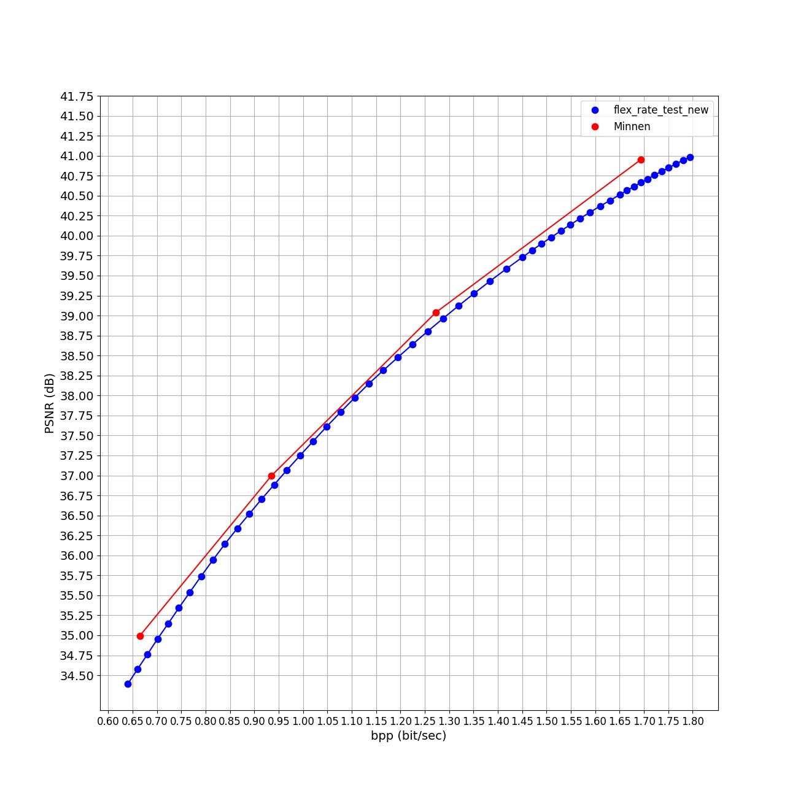

<!---
Our other works on learned video compression:

- Hierarchical Learned Video Compression (HLVC) (CVPR 2020) [[Paper](https://arxiv.org/abs/2003.01966)] [[Codes](https://github.com/RenYang-home/HLVC)]

- OpenDVC: An open source implementation of DVC [[Codes](https://github.com/RenYang-home/OpenDVC)] [[Technical report](https://arxiv.org/abs/2006.15862)]

# Learning for Video Compression with Recurrent Auto-Encoder and Recurrent Probability Model

The project page for the paper:

> Ren Yang, Fabian Mentzer, Luc Van Gool and Radu Timofte, "Learning for Video Compression with Recurrent Auto-Encoder and Recurrent Probability Model", IEEE Journal of Selected Topics in Signal Processing (J-STSP), 2021. [[Paper]](https://ieeexplore.ieee.org/abstract/document/9288876)

If our paper and codes are useful for your research, please cite:
```
@article{yang2021learning,
  title={Learning for Video Compression with Recurrent Auto-Encoder and Recurrent Probability Model},
  author={Yang, Ren and Mentzer, Fabian and Van Gool, Luc and Timofte, Radu},
  journal={IEEE Journal of Selected Topics in Signal Processing},
  volume={15},
  number={2},
  pages={388-401},
  year={2021}
}
```


If you have questions or find bugs, please contact:

Eren Cetin @ ETH Zurich, Switzerland   

Email: erencetin
--->
# Asymmetric Gained Deep Image Compression With Continuous Rate Adaptation
This is a slightly different re-implementation of the work by [Cui et al. (2021)](https://openaccess.thecvf.com/content/CVPR2021/html/Cui_Asymmetric_Gained_Deep_Image_Compression_With_Continuous_Rate_Adaptation_CVPR_2021_paper.html).
For further detail about the model structure and how multiple rate-distortion trade-offs are achieved using single model, please refer to the paper.

Cui et al. proposes a continuously rate adjustable learned image compression framework, Asymmetric Gained Variational Autoencoder (AG-VAE). AG-VAE utilizes a pair of gain units to achieve discrete rate adaptation in one single model with a negligible additional computation. Then, by using exponential interpolation, continuous rate adaptation is achieved without compromising performance. Besides, we propose the asymmetric Gaussian entropy model for more accurate entropy estimation. Exhaustive experiments show that our method achieves comparable quantitative performance with SOTA learned image compression methods and better qualitative performance than classical image codecs. In the ablation study, we confirm the usefulness and superiority of gain units and the asymmetric Gaussian entropy model.

```
@inproceedings{cui2021asymmetric,
  title={Asymmetric gained deep image compression with continuous rate adaptation},
  author={Cui, Ze and Wang, Jing and Gao, Shangyin and Guo, Tiansheng and Feng, Yihui and Bai, Bo},
  booktitle={Proceedings of the IEEE/CVF Conference on Computer Vision and Pattern Recognition},
  pages={10532--10541},
  year={2021}
}
```

Such a great paper must be appreciated!

## Training
Our trials to re-implement the model and achieve a similar rate-distortion performance were fruitless. However, it was possible to achieve a similar performance by using a pretrained network proposed by [Minnen et al. (2018)](https://arxiv.org/abs/1809.02736). The pretrained network is acquired from ````compressai``` library that was developed by [Interdigital Inc.](https://interdigitalinc.github.io/CompressAI/zoo.html#). Using the pretrained network and finetuning the model after adding the gain units, the rate-distortion curves in the figure at [Performance section](#performance) is achieved.

The network was trained only for relatively high bit-rates but cannot see a problem for training it also for lower bit-rates.

## Codes

### Dependency
To download the necessary dependencies, please use the ```environment.yml```
```
conda env create -f environment.yml
```
In addition, the framework uses the ```compressai``` library by Interdigital. The library can be downloaded as described in the [link](https://github.com/InterDigitalInc/CompressAI/).
```
pip install compressai
```

### Testing
To run a test yourself, ```testing.py``` is provided in ```test``` folder. After downloading and placing the [pretrained gained model](https://drive.google.com/file/d/12rTrhLtfo0s-UPuF1T-iaDve-HCuN5Nx/view?usp=sharing) in the main directory, you can run the code

```
cd test
python testing.py
```

## Performance

The rate-distortion performance of the re-implementation as following.


